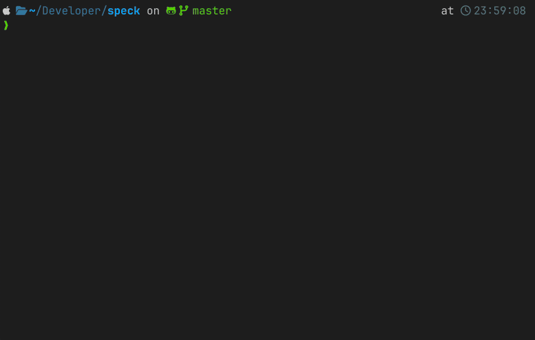
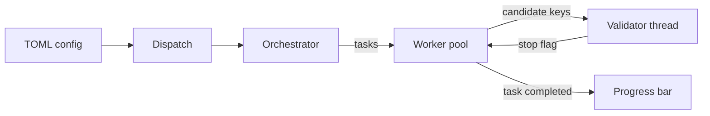

# SpeckProbe

A command line tool that brute-force searches the key space of the Speck block cipher against known plaintext and ciphertext pairs, with the cipher implemented on one scalar and four SIMD backends, plus the benchmark harness used to measure them.



## Overview

Speck is a family of lightweight block ciphers built from addition, rotation and exclusive-or, a structure that maps well onto vector instructions. speck-probe measures how much of an exhaustive key search the vector units of an ordinary processor can absorb. It implements all ten Speck versions in scalar code and for each of SSE2, AVX2, AVX-512 and NEON, then measures throughput at three levels: the block cipher alone, the search engine, and the complete multi-threaded system. The repository carries the measurement environment as well as the program.

Built as the software component of a master's thesis. Complete, with no further development planned.

## Scope

speck-probe searches a configured range of the key space for a key that reproduces a set of known plaintext and ciphertext pairs, under ECB or CBC, on a single machine. It does no network I/O and has no distributed mode.

The key lengths involved put an exhaustive search out of practical reach, and the measurements say so precisely. This is a performance study, not an attack.

## Features

- Brute-force key search over a configured prefix range, all ten Speck versions, ECB or CBC
- Three search operations: encryption, decryption, and encryption with the key schedule computed in flight
- Five backends, chosen from the processor's capabilities at run time or pinned to one instruction set
- Two-stage matching, with a validator thread confirming candidates against the full reference set, and optional reporting of the keys it rejects
- Configurable thread count, stopping as soon as a key is confirmed
- Live progress with ETA and a smoothed key rate, computed on 256-bit integers so spaces wider than 64 bits scale correctly
- Configuration validated before any work starts, rejecting a suffix outside one to four bytes and CBC without an IV
- An `encrypt` command producing reference data in exactly the format the search configuration reads
- Fifteen Criterion targets at three levels, and consolidation of their raw output into one table
- Static analysis of stack and heap allocation from the compiler's intermediate representation

## Tech stack

Rust, edition 2024. The release profile is set for measurement: full LTO, one codegen unit, panic set to abort, symbols stripped, compiled for the host processor.

| Area | Libraries |
|---|---|
| Vectorisation | SSE2, AVX2, AVX-512 and NEON intrinsics, `multiversion`, `seq-macro`, `paste`, `bytemuck` |
| Concurrency | `rayon` for the worker pool and parallel task iterator, `crossbeam` for the bounded channels |
| CLI and config | `clap`, `serde` with `toml`, `base64`, `thiserror`, and `indicatif`, `colored`, `console`, `textwrap`, `terminal_size`, `human_format`, `primitive-types` for terminal output |
| Measurement | `criterion` with raw CSV output, `csv`, `walkdir`, archiso with turbostat and powermetrics, Jupyter with pandas and matplotlib |
| Testing | The standard Rust test harness with `rstest` |

No CI pipeline, container image or packaging target. The project is built from source with cargo.

## Architecture

One binary over a library crate, six public modules by function, with an internal `store` module behind them for configuration and benchmark result files.

| Module | Responsibility |
|---|---|
| `speck` | The block cipher on five backends. No allocation, no state, no input or output |
| `search` | Key and task types, dispatch, orchestration, per-backend engines |
| `cipher` | Reference ECB and CBC over the scalar backend, used to produce test data |
| `cli` | Argument parsing, display, live progress |
| `extract` | Raw benchmark rows into consolidated records |
| `error` | Application-level type joining the configuration, dispatch and cipher errors |



**Keys and tasks.** A key splits into a prefix, constant for one task, and a suffix a worker sweeps in full. The split falls on byte boundaries, so producing the next task is a single increment rather than arithmetic across the whole key. Each task is a self-contained value carrying the prefix, the suffix range and one reference pair, with no heap data and nothing shared. The validator checks each candidate against every reference pair, and the first that passes sets an atomic flag the workers read before taking further work.

**Modes and backends.** For CBC the IV is folded into the first reference pair before the run, so the engine compares a single block in both modes and the validator does the real chaining. Automatic backend selection resolves the best target at run time, preferring AVX-512, then AVX2, then SSE2 on x86-64 and NEON on aarch64. The generated table over version, suffix length, operation and mode comes to 240 monomorphised search paths per backend.

**Instruction gaps.** Rust has no 24 or 48-bit integer, so those two Speck word widths are emulated in the next size up with every result masked back. SSE2, AVX2 and NEON have no vector rotate, so rotations are two shifts and an or. Nor can the two older x86 backends reduce a comparison to a compact mask, which AVX-512 returns directly, so they rebuild it in software. The cost shows in the code: those comparators run to 133 and 163 lines against 15 for scalar, 71 for AVX-512 and 82 for NEON.

## Usage

Requires a Rust toolchain supporting edition 2024. The build compiles for the host processor, so build on the machine that will run the search.

```bash
cargo build --release
./target/release/speck-probe sample search   # writes a sample config, --force overwrites
./target/release/speck-probe search          # reads ./config/search.toml by default
```

Add `--spurious` to also print keys that matched only the first reference pair.

| Config field | Meaning |
|---|---|
| `cipher_mode` | ECB or CBC |
| `speck_version` | Which of the ten versions to search |
| `cipher_function` | Encryption, decryption, or encryption with the key schedule in flight |
| `suffix_bytes_size` | How much of the key one task covers, one to four bytes |
| `num_threads` | Size of the worker pool |
| `backend_hint` | Automatic selection, or one backend the build supports |
| `start`, `end` | First and last key prefix, as space-separated hex bytes |
| `data`, `expected` | Reference pairs, base64 over 16-byte little-endian word pairs |
| `iv` | Initialisation vector, exactly 16 bytes, required for CBC |

Reference data comes from the `encrypt` command, which encrypts a string under a chosen version, mode, hex key and optional IV. It prints plaintext and ciphertext in the layout the configuration expects, so the values paste straight into `data` and `expected`. Benchmarks run with `cargo bench`, and `extract-criterion` consolidates their raw output into one CSV, splitting each composite label into benchmark, backend, version and suffix columns.

## Testing

`cargo test` runs 1 592 tests on an x86-64 host with SSE2, AVX2 and AVX-512 and 882 tests on an aarch64 host with NEON. Vector tests check the running processor for the extension they need and skip themselves when it is missing.

| Area | What they check |
|---|-|
| Block cipher | The specification's test vectors, every version, operation and backend |
| Search engine | The target key placed alone in the range, at its start, middle and end |
| Whole runtime | End to end at 1, 2, 4 and more threads than the machine has cores, both modes, all three operations |
| Reference cipher | Known vectors, round trips in both modes, and the unaligned input error |

## Measurement environment

Benchmark numbers are comparable only if the machine underneath holds still, so the repository carries the environment that makes that true.

`archlive/` builds a custom Arch Linux live image for x86-64, with the package source pinned to a dated archive snapshot, mitigations off, the TSC as clock source, most driver modules blacklisted and the performance governor set before login. Its build script vendors every dependency, so the image builds the project without a network. The run script disables turbo for each test, pins benchmarks to one physical core under real-time scheduling, samples frequency and power on a different core, and leaves fixed gaps between tests. For aarch64, `macos/run.sh` does the equivalent within what the platform allows, restoring every setting it changed through an exit trap.

`analysis/notebooks/` turns the raw output into results, using a Theil-Sen slope at the cipher level, a percentile bootstrap of the median for the coarser two, and geometric means for aggregation. Two further notebooks classify each run's frequency trend by rank correlation with a robust slope, and count allocations per backend and operation from the compiler IR.

## Results

- Peak system throughput of about 6.8 billion keys per second, for Speck 32/64 on AVX-512 with a two-byte suffix
- Over nine times faster than scalar on AVX-512 and over four times on NEON for Speck 32/64, with the factor falling as word width grows
- Exhausting the Speck 32/64 key space at that rate would still take over 86 years on x86-64 and over 442 years on aarch64 in the worst case
- No heap allocation in any measured configuration, and no stack allocation instruction at all in the IR at the highest optimisation level
- ECB and CBC reach practically identical system throughput on every backend, and the two-byte suffix is fastest in every mode
- Against a published GPU implementation, a graphics card from 2014 beat the fastest x86-64 configuration in every variant except Speck 32/64, and aarch64 was slower than every card compared

Two limits apply. The benchmark matrix is bounded by available machine time, so the parameters representing the system at each level were selected from the level below rather than by measuring every combination. Part of the aarch64 system results were taken while the machine was thermally throttling, a characteristic of that test platform rather than of the implementation.

## Project structure

```
src/            speck, search, cipher, cli, store, extract, bin
benches/        Criterion targets at three levels
archlive/       Arch Linux measurement image
macos/          macOS measurement driver
tools/          intermediate representation emission
analysis/       Jupyter notebooks
```

## Authors

Jan Chojnacki
